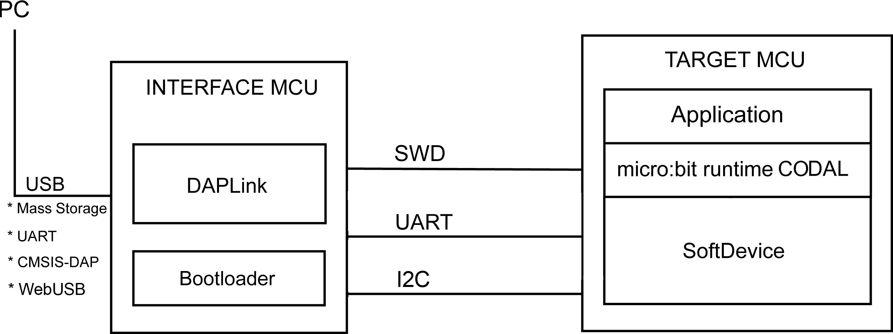
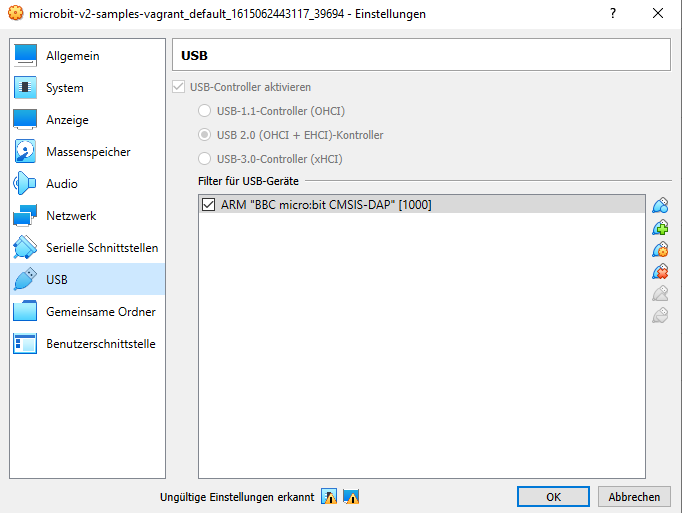

.. image:: https://readthedocs.org/projects/microbit-v2-debugging/badge/?version=latest
   :target: https://microbit-v2-debugging.readthedocs.io/en/latest/?badge=latest

.. readme-header-marker-do-not-remove

BBC Micro:Bit v2 Debugging
##########################

This repository shall explore the possibilities to debug the BBC microbit v2.

.. |ImageLink| image::   http://www.plantuml.com/plantuml/proxy?cache=no&src=https://raw.githubusercontent.com/chatelao/microbit-v2-debugging/main/images/overview.iuml
               :target:  http://www.plantuml.com
   
Overview of the hardware capabilities
--------------------------------------

   
   Schema of a CMSIS-DAP debugger setup

Debugging with CODAL
----------------------

Get the sources:
::

   git clone https://github.com/chatelao/microbit-v2-samples-vagrant

Build the software (Standard):
::

   cd microbit-v2-samples
   python build.py

In utils/python/codal_utils.py about the build logic called is found here:
::

   cmake .. -DCMAKE_BUILD_TYPE=RelWithDebInfo -G \"Unix Makefiles\"

So a manual run can be started this way:
::

   cmake -DCMAKE_BUILD_TYPE=Debug -G "Unix Makefiles"
   make clean
   make -j 10 VERBOSE=1

Debugging with PlatformIO
--------------------------

PlatformIO supports the debugging over the "DAP-Link" interface from 
* https://docs.platformio.org/en/latest/boards/nordicnrf51/bbcmicrobit.html

::
   platformio platform install nordicnrf52 --with-all-packages

Debugging with Arduino
-----------------------

Debugging with OpenOCD on a Virtualbox
----------------------------------------------

Because "normal" users don't have enough USB permissions, it is easier to run OpenOCD with sudo or as root.
::

   sudo openocd -f interface/cmsis-dap.cfg -f target/nrf52.cfg

HEX-Format
##########

- https://tech.microbit.org/software/hex-format/
- https://en.wikipedia.org/wiki/Intel_HEX
- https://tech.microbit.org/software/readout_hex/
- https://microbit-micropython.readthedocs.io/en/v2-docs/devguide/hexformat.html

Appendix
##########################

Virtualbox USB filter
---------------------

Block Overview
--------------

The target of all debugging is the central MCU **NRF52833**
running the software. The main CPU is debugged using a
SWD/CMSIS-DAP/JLink connection controlled by the **KL27Z**
chip communication itself over USB to the PC/OpenOCD/GDB.

.. image:: images/microbit-hardware-v2-block.svg
   :width: 800 px

Source: https://tech.microbit.org/hardware/#hardware-block-diagram

Adding to UDEV (untested)
----------------------------

I had the same problem (under Ubuntu 14.04). After much googling, I found this: openocd.udev, which shows the following udev rules for the CMSIS-DAP device:

::
   # mbed CMSIS-DAP
   ATTRS{idVendor}=="0d28", ATTRS{idProduct}=="0204", MODE="664", GROUP="plugdev"
   KERNEL=="hidraw*", ATTRS{idVendor}=="0d28", ATTRS{idProduct}=="0204", MODE="664", GROUP="plugdev"
   
After ensuring that my userid was a member of the plugdev group, I created a new udev rules file, /etc/udev/rules.d/98-blenano.rules, with these rules; then reloaded with $ sudo udevadm control --reload-rules, plugged in the MK20 device, and it worked.
