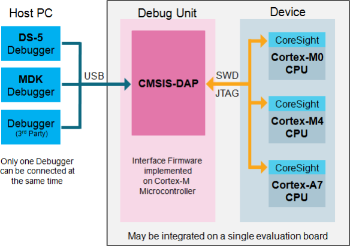

.. image:: https://readthedocs.org/projects/microbit-v2-debugging/badge/?version=latest
   :target: https://microbit-v2-debugging.readthedocs.io/en/latest/?badge=latest

.. readme-header-marker-do-not-remove

BBC Micro:Bit v2 Debugging
##########################

This repository shall explore the possibilities to debug the BBC microbit v2.

.. |ImageLink| image::   http://www.plantuml.com/plantuml/proxy?cache=no&src=https://raw.githubusercontent.com/chatelao/microbit-v2-debugging/main/images/overview.iuml
               :target:  http://www.plantuml.com
   
Overview of the hardware capabilities
--------------------------------------

   
   Schema of a CMSIS-DAP debugger setup

1. With CODAL
1. With PlatformIO
1. With Arduino
1. With MakeCode (fka PXT)

Debugging with CODAL
----------------------

Get the sources:
::

   git clone https://github.com/chatelao/microbit-v2-samples-vagrant

Build the software (Standard):
::

   cd microbit-v2-samples
   python build.py

In utils/python/codal_utils.py about the build logic called is found here:
::

   cmake .. -DCMAKE_BUILD_TYPE=RelWithDebInfo -G \"Unix Makefiles\"

So a manual run can be started this way:
::

   cmake -DCMAKE_BUILD_TYPE=Debug -G "Unix Makefiles"
   make clean
   make -j 10 VERBOSE=1
   
Debugging with PlatformIO
--------------------------

PlatformIO supports the debugging over the "DAP-Link" interface from 
* https://docs.platformio.org/en/latest/boards/nordicnrf51/bbcmicrobit.html

Debugging with Arduino
-----------------------

HEX-Format
##########

- https://tech.microbit.org/software/hex-format/
- https://en.wikipedia.org/wiki/Intel_HEX

Appendix
##########################

Hardware Overview
--------------------------

Block Overview
--------------------------

The target of all debugging is the central MCU **NRF52833**
running the software. The main CPU is debugged using a
SWD/CMSIS-DAP/JLink connection controlled by the **KL27Z**
chip communication itself over USB to the PC/OpenOCD/GDB.

Source: https://tech.microbit.org/hardware/#hardware-block-diagram
